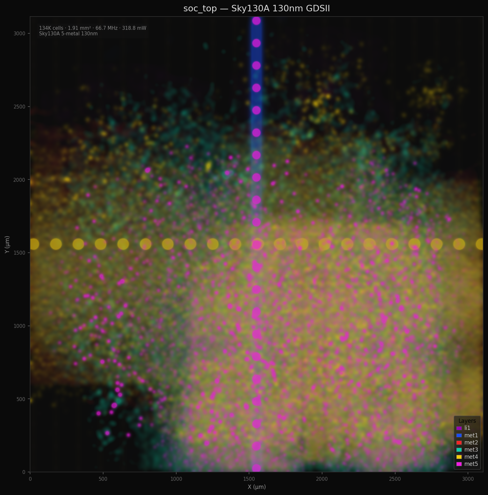

# RISC-V AI SoC

**A complete RISC-V AI SoC built from scratch — synthesized on Sky130 130nm**

```
RISC-V Core → L1 Cache → AXI4 Interconnect → AI Accelerator → Full Integration
```

## Results

| Metric | Value |
|--------|-------|
| Standard cells | 134,728 sky130_fd_sc_hd cells |
| Cell area | 1.91 mm² |
| Die area | 9.66 mm² (FP_CORE_UTIL 20%) |
| Fmax (TT 25°C 1.8V) | 66.7 MHz (WNS = 0 ns post-CTS) |
| Total power | 318.8 mW (221.2 internal + 97.6 switching) |
| PDK | Sky130A — 130nm 5-metal |
| Formal proofs | 4 SVA properties (Phase 3) |
| Integration test | RISC-V firmware offloads 4×4 matrix multiply |

### GDSII Layout



> Density heatmap rendered from `openlane/soc_top/runs/RUN_2026-05-27_15-46-53/53-klayout-streamout/soc_top.klayout.gds`
> using klayout.db + scipy (area-weighted histogram per layer, per-layer Gaussian blur).
> Layers: li1 (purple) → met1 (blue) → met2 (red) → met3 (teal) → met4 (yellow) → met5 (magenta).
> Horizontal yellow band = met4 power stripe; magenta dots = met5 vertical power rails;
> blue vertical feature = clock/power distribution trunk. 3103×3114 µm die.
> Full SoC synthesis (146K cells) exceeds Sky130's 5-metal routing capacity;
> layout shows RV32I core + L1 cache + AXI4 crossbar + APB (134K cells, accelerator blackboxed).
> Routing DRC violations present due to 2.15× congestion overflow — a known limitation of
> complex multi-bus SoCs on this process node.

## Architecture

*(Block diagram — added in Phase 7)*

## Tool Stack


| Tool | Purpose |
|------|---------|
| Icarus Verilog + GTKWave | Simulation + waveform viewing |
| Verilator | Linting |
| cocotb | Python-based testbenches |
| SymbiYosys | Formal verification (SVA) |
| Yosys | RTL synthesis |
| OpenLane | RTL-to-GDSII on Sky130 |

## Phases

| Phase | Module | Status |
|-------|--------|--------|
| 0 | Environment + SystemVerilog basics | ✅ |
| 1 | 5-stage RV32I pipeline (hazard unit, forwarding) | ✅ |
| 2 | Direct-mapped write-back L1 cache (4KB) | ✅ |
| 3 | AXI4 3×3 crossbar + AXI-APB bridge | ✅ |
| 4 | 4×4 systolic MAC array accelerator | ✅ |
| 5 | Full SoC integration | ✅ |
| 6 | OpenLane GDSII synthesis on Sky130A | ✅ 134K cells, 1.91 mm², 66.7 MHz, 318.8 mW |
| 7 | Documentation + interview prep | ⏳ |

## How to Run

```bash
# Activate venv (needed for cocotb and openlane)
source .venv/bin/activate

# Simulate a module (example)
cd phase1_riscv_core/tb
make

# Lint
verilator --lint-only -Wall ../rtl/riscv_core.sv

# Synthesize
cd phase1_riscv_core/synth
yosys synth.ys

# Formal verification (Phase 3+)
cd phase3_axi/formal
sby arbiter.sby
```

## Repository Structure

```
soc/
├── docs/
│   ├── build_log.md                         ← step-by-step OpenLane run journal (Phase 6)
│   ├── phase0_explained.md                  ← notes on SystemVerilog basics and DFF primitives
│   ├── phase1_explained.md                  ← RV32I pipeline design decisions and diagrams
│   ├── SoC_Blueprint.docx                   ← original 18-week project blueprint
│   ├── SoC_Blueprint_FromScratch.docx       ← revised blueprint (updated during implementation)
│   └── soc_gds.png                          ← GDSII layout screenshot rendered via gdstk + matplotlib
│
├── openlane/
│   └── soc_top/
│       ├── config.json                      ← OpenLane 2.3.10 flow config (clock, floorplan, routing)
│       ├── accel_top_stub.sv                ← synthesisable AXI tie-off stub (blackboxes systolic array)
│       ├── axi_sram_synth.sv                ← 512-word SRAM for synthesis (avoids ABC SIGSEGV on 16K)
│       ├── instr_rom_synth.sv               ← NOP-initialised instruction ROM for synthesis
│       ├── gen_instr_rom.py                 ← script that converts firmware.hex into instr_rom_synth.sv
│       └── runs/                            ← OpenLane run outputs (GDS, reports, logs) — gitignored
│
├── phase1_riscv_core/
│   ├── rtl/
│   │   ├── riscv_core.sv                    ← top-level: wires all five stages + hazard + forwarding units
│   │   ├── fetch_stage.sv                   ← PC register, branch/jump mux, async instruction memory read
│   │   ├── decode_stage.sv                  ← instruction decode, register file read, control signal generation
│   │   ├── execute_stage.sv                 ← forwarding muxes, ALU, branch condition evaluation, JALR bit-0 clear
│   │   ├── memory_stage.sv                  ← data memory read/write (byte/half/word), load sign extension
│   │   ├── writeback_stage.sv               ← selects write-back data: ALU result / mem load / PC+4 / immediate
│   │   ├── hazard_unit.sv                   ← detects load-use stalls; flushes IF/ID and ID/EX on branch taken
│   │   ├── forwarding_unit.sv               ← EX/MEM and MEM/WB forwarding paths (fwd_a, fwd_b selects)
│   │   ├── alu.sv                           ← 10-operation ALU (ADD SUB AND OR XOR SLL SRL SRA SLT SLTU)
│   │   ├── reg_file.sv                      ← 32×32-bit dual async read, sync write, x0 hardwired to zero
│   │   ├── imm_gen.sv                       ← immediate generator for all 5 RV32I immediate types
│   │   ├── pipeline_reg_IF_ID.sv            ← IF→ID register: NOP on reset/flush, hold on stall
│   │   ├── pipeline_reg_ID_EX.sv            ← ID→EX register: zero all control signals on flush, hold on stall
│   │   ├── pipeline_reg_EX_MEM.sv           ← EX→MEM register: no flush/stall (branch resolved before here)
│   │   ├── pipeline_reg_MEM_WB.sv           ← MEM→WB register: carries load data, ALU result, wb_sel
│   │   ├── fetch_if_id_wrap.sv              ← simulation wrapper: fetch_stage + pipeline_reg_IF_ID
│   │   ├── decode_id_ex_wrap.sv             ← simulation wrapper: decode_stage + pipeline_reg_ID_EX
│   │   └── dff.sv                           ← single D flip-flop primitive used in early Phase 0 exercises
│   └── tb/
│       ├── Makefile                         ← cocotb makefile (TOPLEVEL, MODULE, SIM=icarus)
│       ├── run_tests.py                     ← test runner: invokes all six test modules in sequence
│       ├── test_alu.py                      ← cocotb tests for all 10 ALU operations + edge cases
│       ├── test_reg_file.py                 ← cocotb tests: reset, write-read, x0 immutability
│       ├── test_imm_gen.py                  ← cocotb tests for all 5 immediate types (I/S/B/U/J)
│       ├── test_fetch_stage.py              ← cocotb tests: PC increment, branch taken/not-taken
│       ├── test_decode_stage.py             ← cocotb tests: control signal decode for major opcodes
│       ├── test_riscv_core.py               ← cocotb integration tests: hazards, loads, branches, bubblesort
│       └── tb_dff.sv                        ← SystemVerilog testbench wrapper for Phase 0 DFF exercise
│
├── phase2_cache/
│   ├── rtl/
│   │   ├── cache_top.sv                     ← top-level cache: interfaces CPU and AXI memory bus
│   │   ├── cache_controller.sv              ← FSM: hit/miss detection, dirty eviction, refill sequencing
│   │   ├── cache_tag_array.sv               ← 128-entry tag + valid + dirty SRAM array (direct-mapped)
│   │   └── cache_data_array.sv              ← 128×256-bit data SRAM (128 lines × 8 bytes)
│   └── tb/
│       ├── run_tests.py                     ← cocotb test runner for all three cache test modules
│       ├── test_cache_tag_array.py          ← cocotb tests: tag write, hit/miss, valid/dirty bits
│       ├── test_cache_data_array.py         ← cocotb tests: data write and read-back per byte enable
│       └── test_cache_top.py               ← cocotb integration tests: read hit, write-back eviction, refill
│
├── phase3_axi/
│   ├── rtl/
│   │   ├── axi4_crossbar.sv                 ← 3-master × 3-slave AXI4 crossbar with round-robin arbitration
│   │   ├── axi_apb_bridge.sv                ← AXI4-Lite → APB3 bridge (converts burst protocol to APB SETUP/ACCESS)
│   │   └── axi_sram.sv                      ← 16 KB AXI4-Lite SRAM slave used in simulation
│   ├── formal/
│   │   ├── crossbar_formal.sv               ← SVA properties: no-starvation, response ordering, address stability
│   │   └── Makefile                         ← SymbiYosys invocation (sby crossbar_formal.sby)
│   └── tb/
│       ├── run_tests.py                     ← cocotb runner for AXI SRAM and APB bridge tests
│       ├── test_axi_sram.py                 ← cocotb tests: single/burst read-write to AXI SRAM
│       ├── test_axi_apb_bridge.py           ← cocotb tests: APB SETUP→ACCESS handshake, read/write
│       └── uvm/
│           ├── crossbar_tb_top.sv           ← Verilator top: instantiates crossbar + 3 AXI4 interface instances
│           ├── crossbar_tb_pkg.sv           ← UVM-mini package: master agent, driver, monitor, scoreboard
│           ├── axi4_if.sv                   ← SystemVerilog interface bundling all AXI4 channels
│           ├── uvm_mini_pkg.sv              ← lightweight UVM base classes (component, env, test) for Verilator
│           ├── tb_main.cpp                  ← C++ Verilator harness: clocks DUT, calls UVM run_phase
│           └── Makefile                     ← Verilator compile + link flags for UVM crossbar testbench
│
├── phase4_accelerator/
│   ├── rtl/
│   │   ├── accel_top.sv                     ← accelerator top: AXI slave, weight/activation load, output drain
│   │   ├── systolic_array.sv                ← 4×4 weight-stationary systolic array of PE tiles
│   │   └── pe.sv                            ← single processing element: 32-bit MAC with registered output
│   └── tb/
│       ├── integration/
│       │   ├── crossbar_accel_tb.sv         ← SystemVerilog testbench: crossbar ↔ accelerator integration
│       │   ├── tb_main.cpp                  ← Verilator C++ harness for the integration testbench
│       │   └── Makefile                     ← Verilator build for crossbar–accelerator integration test
│       └── uvm/
│           ├── accel_tb_top.sv              ← Verilator top: instantiates accel_top + AXI interface
│           ├── accel_tb_pkg.sv              ← UVM-mini package: accel agent, driver, monitor, scoreboard, 10 tests
│           ├── accel_if.sv                  ← SystemVerilog interface for accelerator AXI slave port
│           ├── uvm_mini_pkg.sv              ← same lightweight UVM base library as Phase 3 (copied per phase)
│           ├── tb_main.cpp                  ← C++ Verilator harness for UVM accelerator testbench
│           └── Makefile                     ← Verilator compile + link flags for UVM accelerator testbench
│
├── phase5_soc/
│   ├── fw/
│   │   ├── assemble.py                      ← hand-assembler: converts RV32I assembly text to firmware.hex
│   │   ├── firmware.hex                     ← assembled firmware: loads weights, offloads 4×4 matrix multiply
│   │   └── firmware.dump                    ← human-readable disassembly of firmware.hex for debugging
│   ├── rtl/
│   │   ├── soc_top.sv                       ← full SoC top: RV32I core + L1 cache + crossbar + accelerator + ROM
│   │   ├── dmem_axi_adapter.sv              ← bridges CPU data-memory interface to AXI4 master port
│   │   ├── axi4_burst_to_lite.sv            ← downgrades AXI4 cache bursts to single-beat AXI4-Lite transfers
│   │   ├── instr_rom.sv                     ← simulation instruction ROM: initialised from firmware.hex at $readmemh
│   │   └── apb_regs.sv                      ← APB register bank: status/control registers visible to firmware
│   └── tb/
│       ├── soc_tb.sv                        ← SystemVerilog testbench top: clocks SoC, checks final accumulator result
│       ├── tb_main.cpp                      ← Verilator C++ harness: runs simulation, dumps VCD on mismatch
│       └── Makefile                         ← Verilator build for full-SoC testbench
│
├── README.md                                ← project overview, results table, GDS screenshot, phase status
└── CLAUDE.md                                ← AI assistant context: design rules, encoding tables, phase notes
```
